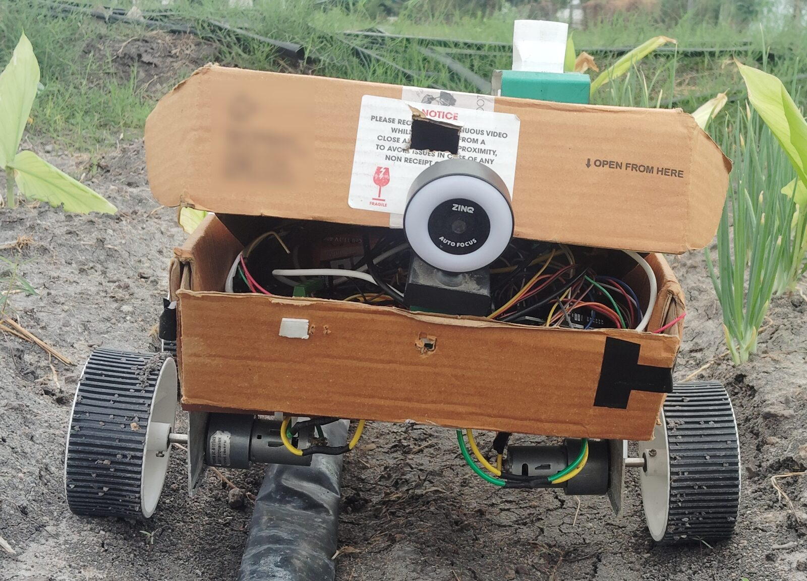
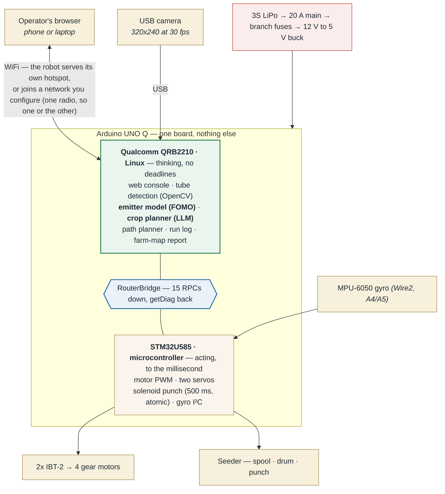

# YaerBot — Farm OS seeding robot

> **yaer** — from **ஏர்** (_ēr_), the Tamil word for the plough: the tool that tills the
> soil before sowing.

An autonomous seeding robot for the **Arduino Physical AI Challenge India 2026**, built on a
single **Arduino UNO Q**. It _plans_ what and when to sow, _acts_ on either plain or
drip-irrigated ground, and _reports_ a map of every seed it placed.

<p align="center">
  <a href="https://www.youtube.com/watch?v=LSY9eQG0oHc">
    
  </a>
</p>

<p align="center">
  <b>▶ <a href="https://www.youtube.com/watch?v=LSY9eQG0oHc">Watch the demo</a></b>
  &nbsp;·&nbsp; 4 min 25 s &nbsp;·&nbsp; the planner, the seeder built by hand, and both seeding modes in the field
</p>

**Two AI models run on the board itself, with no network:**

- **A language model decides _when_ to sow** — **Qwen 2.5 (1.5B)** via Ollama, reasoning over
  the Tamil panchangam, the biodynamic calendar and live weather. The dates come from a
  deterministic reconciliation, so the model explains them rather than inventing them.
- **A vision model decides _where_** — an **Edge Impulse FOMO** detector, trained on
  photographs this robot took itself, finds the emitters along a drip line so every seed lands
  where the water already reaches.

On the same board, while it drives:

- **OpenCV** finds the drip line and steers to keep the robot on it — a black tube on dark
  soil, which is why it profiles brightness instead of looking for edges.
- **A gyro** closes the loop on every turn: **0.3°** worst error across four consecutive 90°
  turns, on ground whose grip changes as it goes.
- **The microcontroller** times the seed punch to the millisecond, so a busy Linux side cannot
  stretch how long a pulse-rated solenoid stays energised.

**Contents** 
- [Why](#why) 
- [Architecture](#architecture) 
- [How the UNO Q is used](#how-the-uno-q-is-used) 
- [Status](#status) 
- [Repo layout](#repo-layout) 
- [Documentation](#documentation)

Running it: [`AGENTS.md`](AGENTS.md) — the three services, in start order, and how to deploy
a change to the board.

## Why

Farmers sow by hand, broadcasting the seed. That costs three ways:

- **Seed** — it scatters unevenly, so you over-sow to make up for the gaps.
- **Weeding** — scattered seed leaves no clean rows to weed between, so weeding stays slow
  hand work and takes longer than the sowing did.
- **Water** — on drip-irrigated land the water only reaches the emitters. Seed that lands
  anywhere else is barely watered.

This robot places one seed at a time at the spacing you set. On drip land it **finds the
emitters by sight** and seeds to them, so every seed sits where the water already goes. It
picks the date from the local panchangam and biodynamic calendar — groundnut goes in on
**Keel Nokku Naal** — and hands back a map of what it planted.

## Architecture



A fuller version, laid out around the same idea and sized for a slide or a video frame:
[`docs/architecture.svg`](docs/architecture.svg) (PNG: [`architecture@2x.png`](docs/architecture@2x.png)).
Circuit-level detail is in [`docs/schematic/`](docs/schematic/).

- **Arduino UNO Q** — Qualcomm Linux side (App Lab Python app, on-device CV + LLM) **+**
  STM32U585 MCU (real-time GPIO / motor + seeder control over RouterBridge RPCs).
- **Camera** — a **USB webcam** on the board, 320×240 at a steady 30 fps. It replaced an
  ESP32-CAM that managed only 0.7–6.7 fps over WiFi; the firmware and the measurements behind
  the switch are kept in [`firmware/esp32_cam/`](firmware/esp32_cam/) and
  [`docs/usb-camera.md`](docs/usb-camera.md).
- **On-device AI** — an Edge Impulse **FOMO** model for emitter detection, and a small LLM via
  Ollama for the planner, run **staggered, never concurrent** with the vision model.
- **Sensing** — the camera and the gyro. No soil probes and no GPS are fitted.
- **Seeder** — a hopper feeds a **pocket drum** that meters seed by volume, not by timing, so a
  seed cannot be crushed between closing surfaces. Seed size is handled by **swapping the
  drum**: one printed drum per size, slid off the servo horn and replaced. Groundnut to sesame
  needs no other change. The arm then turns to whichever angles you set, so the planting
  pattern is a setting rather than a mechanism.

## How the UNO Q is used

Both halves of the board do real work, and the split between them is what makes the seeder
accurate.

**The seeder's punch must hold for exactly 500 ms while a neural network runs on the same
board.** On a single-processor system those two compete. Here they don't: `plantSeed` is a
single RPC that the **STM32 executes atomically** — drum release, 100 ms settle, coil on,
500 ms, coil off — so a busy Linux side, a garbage-collection pause, or even a dropped
bridge cannot stretch the time a pulse-rated solenoid is energised. Nothing on the Qualcomm
side has to meet a deadline, because none of the timing lives there.

| UNO Q capability                         | What depends on it                                                                                                                                                                                                      |
| ---------------------------------------- | ----------------------------------------------------------------------------------------------------------------------------------------------------------------------------------------------------------------------- |
| **STM32U585 MCU** — real-time GPIO       | motor PWM, both servos, the solenoid's timed punch, the gyro on `Wire2`. 15 RPCs: `setMotors` `stop` `plantSeed` `indexSpool` `dropSeed` `punch` `retract` `getMoisture` `getTemperature` `getEC` `getBattery` `getDiag` … |
| **Qualcomm Linux side** — compute        | the web console, path planning, the LLM planner, OpenCV, and Edge Impulse inference                                                                                                                                     |
| **RouterBridge** — the link between them | every actuator command, and `getDiag`, which reports back from the MCU what actually reached the driver pins                                                                                                            |
| **App Lab bricks**                       | `arduino:web_ui` serves the operator console; `arduino:object_detection` runs the trained model in its own container                                                                                                    |
| **One board, nothing else**              | the UNO Q runs the LLM, the CV and the web console itself — no companion computer                                                                                                                                        |

### Two AI workloads, on the board, no network

- **A small LLM via Ollama** turns the computed sowing recommendation into plain language
  (`qwen2.5:1.5b` by default; `gemma2:2b` is installed and selectable)
- **An Edge Impulse FOMO model** finds drip emitters in the camera feed

Both run **on the board**; nothing calls an API. They are run **staggered, never
concurrently** — at ~1 GB free with a model resident, and vision needing the CPU during a
run, sharing them would starve both. The planner finishes before the robot moves.

The vision model was also **trained on data this robot collected itself**: the Camera tab
drives the drip line and saves frames, those frames are labelled and trained into a FOMO
model, and the model is installed back onto the same board. The loop closes on one device.

### Fully committed I/O

The pin budget is spent, and it drove real design decisions. The seeder's servos had to move
to **digital** pins because `Servo` gives no motion at all on A3 — which then freed A3 for the
solenoid's MOSFET gate. And **A4/A5 went to the gyro**, because they carry `Wire2` (i2c3), the
only I2C the board actually exposes: the header pins silk-screened SDA/SCL have no I2C
peripheral behind them on this core. That cost the battery monitor its input.

Full sheets, colour-coded by net: [`docs/schematic/`](docs/schematic/).

### Board behaviour we had to find the hard way

Documented in [`troubleshooting.md`](docs/troubleshooting.md) in case they save someone else time:

- `pinMode()` on a PWM pin **before** `analogWrite()` kills PWM on that pin (outputs ~0 V)
- `Servo` works only on **digital** pins; A3 gives no motion at all
- ADC full scale is **VREF+ ≈ 3.3 V**, not 5 V
- `Servo.detach()`/`attach()` at runtime **hangs the MCU**, taking the bridge with it
- `halt`/`poweroff` auto-restart while power is applied — only cutting power keeps it off

## Status

**All four acts run end-to-end on the real robot.** Plain-land seeding does multi-row
serpentine on soil with a real row change, logged positions and a generated farm map. Drip
seeding follows the lateral, stops at detected emitters and plants within ±5 cm (measured +0
to +10 mm). Turns are closed-loop on the gyro — worst error 0.3° across four consecutive 90°
turns. The planner runs on-device with no network call.

Two vision limits are open and worth stating plainly: the emitter model also fires on plain
tube, so a 12-emitter row draws about 14 stops; and a hard shadow across the row stops the
tube detector, which waits rather than steering blind. Both are written up with their
evidence — see the demo plan.

## Repo layout

```
firmware/                C++ for the two microcontrollers
  farm_os/               STM32U585 sketch — motor/seeder/sensor RPCs over RouterBridge
  esp32_cam/             ESP32-CAM — superseded by the USB webcam; kept for the record

console/                 the App Lab application that runs ON the robot
  app.yaml               declares the bricks (web_ui, object_detection)
  python/main.py         backend: web UI, Bridge RPCs, camera loop, run state machine
  python/vision/         on-device CV
    vision.py              detect_tube — 4-band brightness profile + robust line fit;
                           detect_crossing — the next lateral, for the traverse
    emitter_ml.py          Edge Impulse FOMO detector, classical fallback
    camera.py              frame source: USB camera by sysfs name, MJPEG stream, or file
  assets/                web operator console — index.html / app.js / style.css

farmos/                  hardware-free brain, testable off the robot
  config.py                SeedPlan — the run config
  path.py                  boustrophedon path planner (Act 2)
  robot_io.py              RobotIO: SimRobot (sim) + BridgeRobot (real UNO Q)
  executor.py              timed dead-reckoning executor + RunLog
  report.py                RunLog -> SVG farm-map report (Act 4)
  planner/                 Act 1 — on-device LLM seeding advisor

scripts/                 field_test.py — field calibration + run harness (solve/tsolve,
                         row, cycle, spool); gen_schematic.py / gen_arch.py — the diagrams;
                         lock_focus.py — find and pin the camera's focus;
                         score_emitter_model.py — grade a retrain against saved frames
tests/                   214 tests — unit gates plus hand-labelled field frames, so a
                         detector that finds nothing fails. Run: python -m pytest
examples/                offline demos — the four acts end to end, no hardware
runs/                    REAL artifacts off the robot: run logs, generated report,
                         MCU per-move diagnostics, battery telemetry
webchat/                 standalone planner-chat prototype (the console has its own Plan tab)
deploy/                  systemd units + install script
docs/                    see the index below
```

## Documentation

| Doc                                               | What it covers                                                                                                                                                                                                                       |
| ------------------------------------------------- | ------------------------------------------------------------------------------------------------------------------------------------------------------------------------------------------------------------------------------------ |
| [`bom.md`](docs/bom.md)                           | **bill of materials, as built** — plus what was evaluated and rejected                                                                                                                                                               |
| [`schematic/`](docs/schematic/)         | **circuit schematics, as built** — power distribution and protection, drive, seeder, gyro. Colour-coded by net; generated from code by [`scripts/gen_schematic.py`](scripts/gen_schematic.py) so they cannot drift from the firmware |
| [`seeder.md`](docs/seeder.md)                     | the seeding mechanism — arm, hopper, swappable pocket drums, solenoid punch. **The pre-build design doc**: every section is tagged built / different / not built                                                                     |
| [`ml-emitter-model.md`](docs/ml-emitter-model.md) | **the AI workflow** — capture → label → train FOMO → deploy on-device                                                                                                                                                                |
| [`drive-precision.md`](docs/drive-precision.md)   | open-loop drive model, calibration method, error budget                                                                                                                                                                              |
| [`troubleshooting.md`](docs/troubleshooting.md)   | every hardware fault hit during the build, with root cause and fix                                                                                                                                                                   |
| [`runs/`](runs/)                                  | **real data off the robot** — run logs, the generated farm map, MCU diagnostics, battery telemetry                                                                                                                                   |
| [`usb-camera.md`](docs/usb-camera.md)             | **why the camera changed** — the frame-rate measurements that retired the ESP32-CAM, and the focus lock                                                                                                                               |
| [`architecture.svg`](docs/architecture.svg)       | the system diagram at slide and video size                                                                                                                                                                                           |
