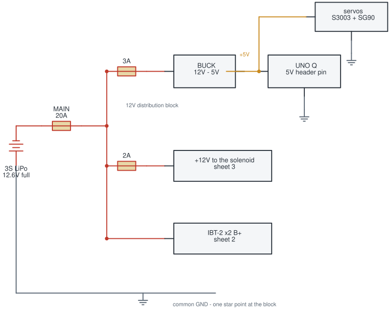
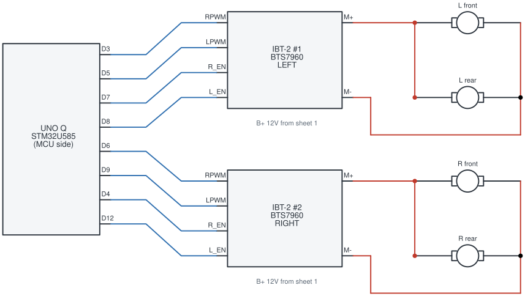
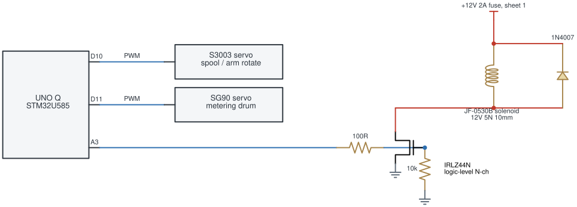
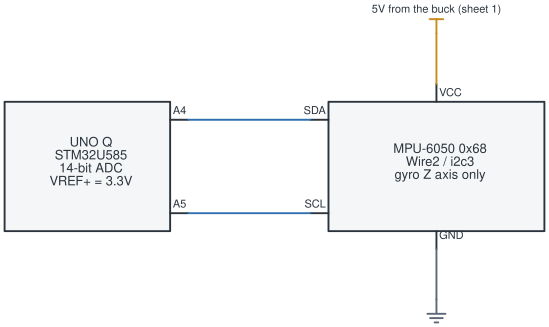

# Circuit schematics — as built

Seeding robot for the Arduino Physical AI Challenge India 2026, built on the Arduino UNO Q.
Four sheets: power distribution, drive, seeder, and the gyro.

*as built 2026-08-20 · generated by [`scripts/gen_schematic.py`](../../scripts/gen_schematic.py) ·
pin truth: [`firmware/farm_os/farm_os.ino`](../../firmware/farm_os/farm_os.ino)*

**Colour is the net's class, not decoration:**
🟥 12 V battery side · 🟧 5 V rail (buck out) · 🟦 logic / I²C · ⬜ ground

> [!NOTE]
> These are generated from code rather than drawn in a GUI, because the schematic has to stay
> true to firmware that moves: A4 was the battery divider until the gyro took it, the EC drive
> moved off D10 when the seeder spool claimed it, and A5 has been three different things. This
> way it diffs like code and every pin traces to a `#define`.

---

## Sheet 1 — Power distribution and protection

Every branch has its own fuse, sized to its own wire. All power branches are 1 mm² (~17 AWG)
stranded and soldered.

> [!CAUTION]
> **Fuse for the fault current, gauge for the running current.**
> On 2026-08-15 the 12 V solenoid feed — a Dupont jumper — shorted while the battery was being
> moved and **caught fire. The 20 A main fuse never blew**, because a 20 A fuse cannot protect a
> wire that opens at about 1.5 A: the wire becomes the fuse. Nothing was electrically wrong. The
> solenoid had worked for days, and the diode and MOSFET were both fine.

- Branch fuses: **2 A** solenoid, **3 A** buck input. Main: **20 A** blade.
- Power the UNO Q from its **5 V header pin, not USB**. USB creates a ground loop that corrupts
  the ADC, and VBUS keeps the board from staying powered off.
- As built there is **no bulk capacitor** on the 5 V feed — the buck output goes straight to the
  UNO Q's 5 V header pin.
- Every ground symbol is the **same node**, a single star point at the distribution block. That
  is deliberate: a second ground path is what makes a loop, and a ground loop through USB is
  what corrupted the ADC.

---

## Sheet 2 — Drive: 4WD skid-steer

One IBT-2 (BTS7960) per side, two gear motors in parallel across each driver's outputs. Motor
supply comes straight off the 12 V block on sheet 1.

- The motors sit **between M+ and M−**, not between M+ and ground. A BTS7960 is an H-bridge, so
  both outputs are driven and neither is a ground reference.
- PWM is available on `D3`, `D5`, `D6`, `D9` **only**.
- Calling `pinMode()` on a PWM pin **before** `analogWrite()` kills PWM on that pin — it outputs
  about 0 V.
- Heading is closed-loop on the gyro (sheet 4): worst error **0.3°** across four consecutive 90°
  turns. There are **no wheel encoders**, so distance is timed dead reckoning — and a skid-steer
  pivot turns by scrubbing, so its calibration changes with the ground.

---

## Sheet 3 — Seeder: servos and the solenoid punch

Two servos for metering and arm rotation, and one solenoid driven as a low-side switch. Servo
*power* is the 5 V rail on sheet 1; only the signal lines appear here.

> [!WARNING]
> **Diode orientation.** The 1N4007's band (cathode) goes to **+12 V**. Fitted backwards it is a
> dead short across the fused branch the moment 12 V appears.

- **As built: one solenoid**, at one end of the arm. The arm carries two outlets 180° apart; the
  second punch is not fitted.
- Servos work only on **digital** pins on the UNO Q — `A3` gives no servo motion at all, which is
  why the spool and drum are on `D10`/`D11` and `A3` was left to drive the MOSFET gate.
- `Servo.detach()` / `attach()` at runtime **hangs the MCU**, taking the RouterBridge link down
  with it.
- The `10k` gate-to-source pulldown holds the coil off while `A3` floats during MCU reset.
- `D13` is reserved as the second solenoid's gate for when that punch is fitted.

---

## Sheet 4 — The gyro, the only sensor fitted

An MPU-6050 on `Wire2`, used for its Z-axis gyro alone. `VCC` is the **5 V rail from the buck**;
the module runs its own regulator, so its `SDA`/`SCL` idle at 3.3 V rather than 5 V — which
matters, because the UNO Q's analog pins are **not** 5 V tolerant. Worth confirming with a meter
on the bus before trusting it.

> [!IMPORTANT]
> **The header pins labelled SDA/SCL do not work for I²C.** On this core the board overlay hands
> `D20`/`D21` to USART3 and leaves `i2c2` disabled, so `Wire.begin()` succeeds, every transfer
> fails, and a bus scan finds nothing however correct the wiring is. `Wire2` (`i2c3`) on
> **A4/A5** is the only solderable I²C on the board. The pads still work as plain GPIO, so a pin
> test passes and misleads.

- **What the gyro bought:** heading went from ±5–10° of open-loop guesswork per turn to **0.3°
  worst error** across four consecutive 90° turns.
- **What it cost:** A4 and A5 were already spoken for, so three things were given up — the
  **battery monitor** (`BATT_PRESENT 0`; `getBattery` answers `present:false` rather than
  reporting a floating pin, and runs must pass `nobatt`), **gate sense** (`GATE_SENSE 0`, since
  an `analogRead` on A5 re-muxes the pad and would kill the bus mid-run), and **motor current
  sense** (`CURRENT_SENSE 0`, never wired). An **ADS1115** over I²C would restore all three
  without needing a free analog pin.
- **No GPS**, and that is a decision rather than an omission: consumer GPS is ±2–5 m across a plot
  3–6 m wide, so it would be *less* accurate than dead reckoning, and it gives no heading standing
  still. The problem was always plot-scale *relative* odometry.
- The ADC is **14-bit** and full scale is **VREF+ ≈ 3.3 V**, not 5 V. The analog pins are not
  5 V tolerant.

---

Regenerate with `pip install schemdraw && python3 scripts/gen_schematic.py`.
Bill of materials: [`../bom.md`](../bom.md). Seeder mechanism: [`../seeder.md`](../seeder.md).
